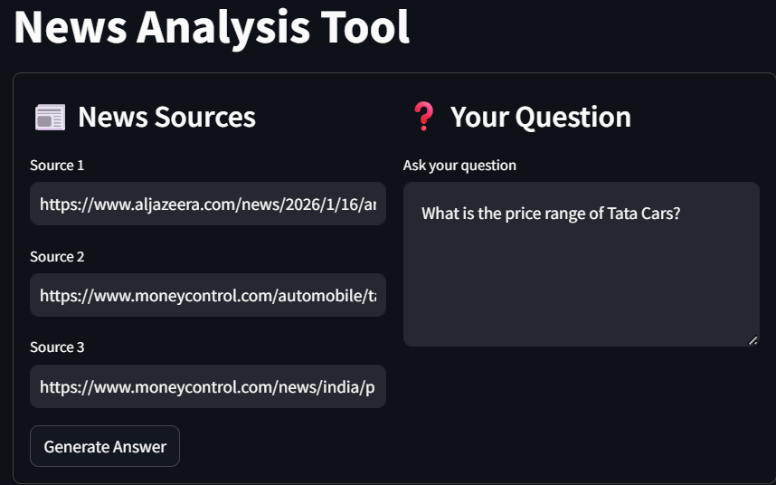

# News Analysis Tool

This project is a Retrieval-Augmented Generation (RAG) based News Analysis Tool designed to help users quickly extract precise, trustworthy answers from multiple news articles.
Instead of reading entire articles, users can provide news URLs and ask a natural language question to receive a concise answer along with its source.

The system is domain-agnostic and works across news topics such as politics, technology, finance, sports, and more.

## Libraries Used

* Numpy

* Pandas

* LangChain

* Faiss

* openai

* Streamlit

## Demo

## Key Features

* Input multiple news article URLs

* Automatic article loading and cleaning

* Text chunking for efficient retrieval

* Semantic search using embedding-based similarity

* Retrieval of the most relevant content chunk

* LLM-generated concise and factual answers

* Source attribution for transparency

* Simple and clean Streamlit-based UI

## Use Case

* Quick research from multiple news articles

* Fact-checking across trusted sources

* Journalists and analysts summarizing current events

* Students and professionals tracking news efficiently

* Any scenario requiring question-based news analysis

## Project Highlights

* Built using LangChain

* Implements RAG architecture

* Embedding-based semantic retrieval

* LLM grounding to reduce hallucinations

* Lightweight and scalable design

* Focused on real-world information retrieval

## How to use this RAG based AI Teaching Assistant for your own course

Run the application using streamlit run app.py. Once the Streamlit app loads, enter the news source URLs and your question. The system will analyze the articles and display the generated answer along with its source.
